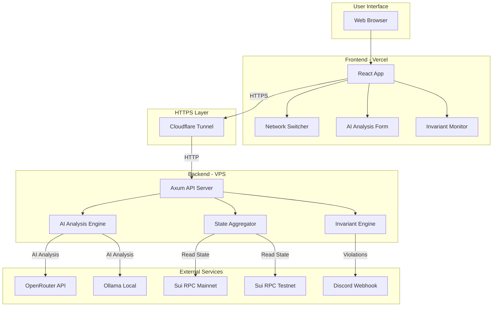
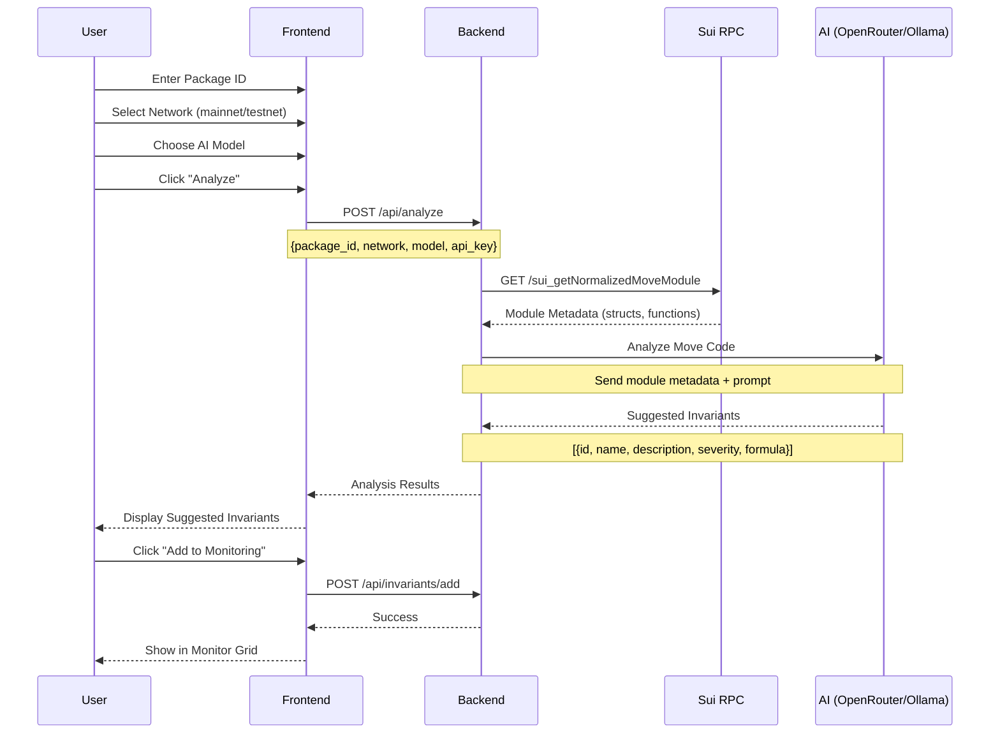
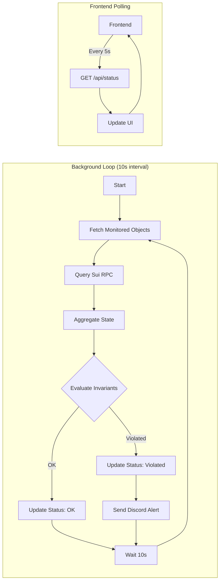
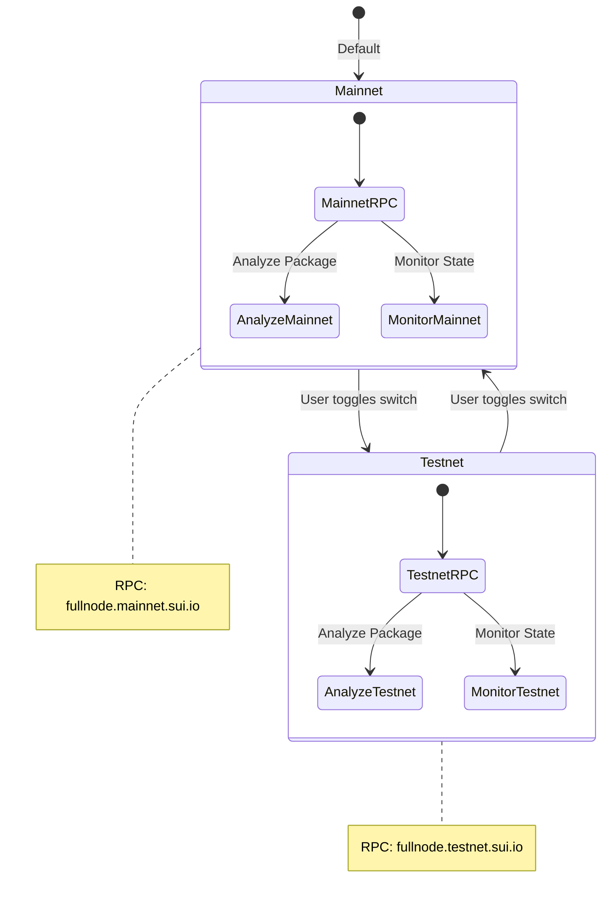
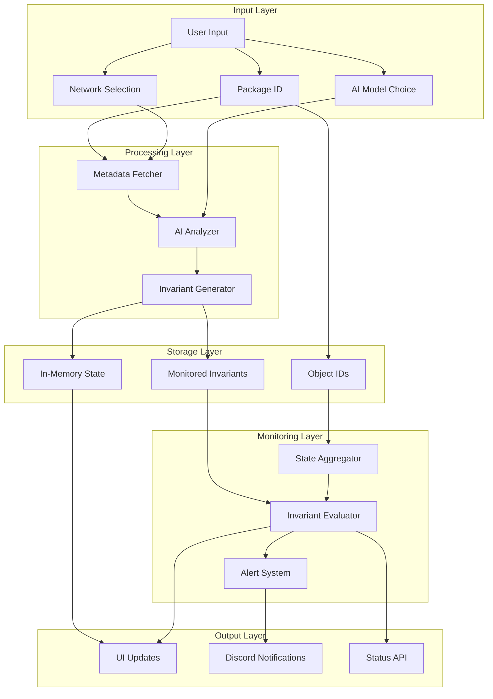
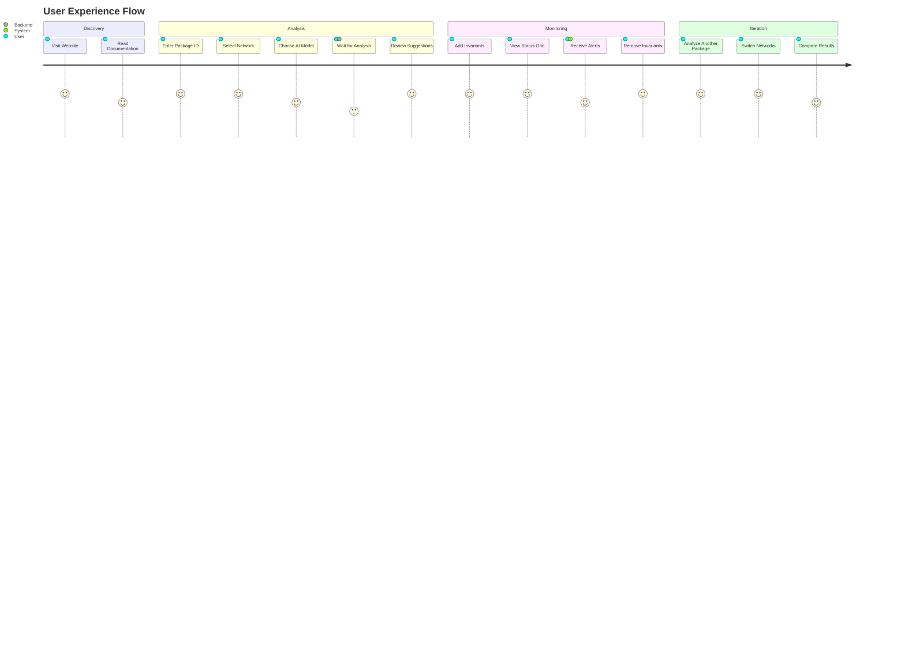
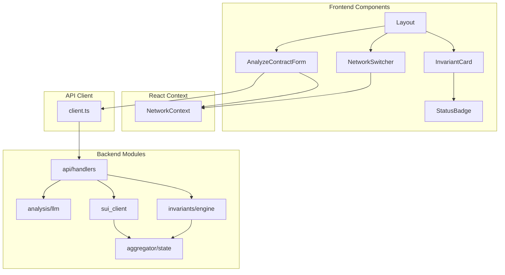
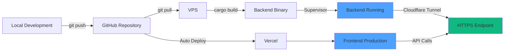
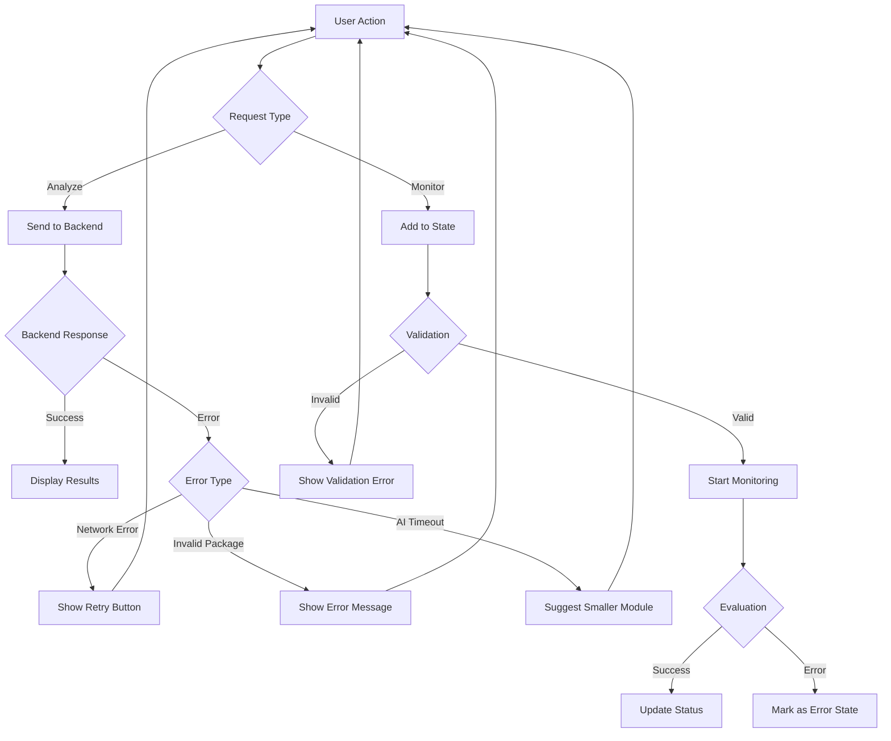
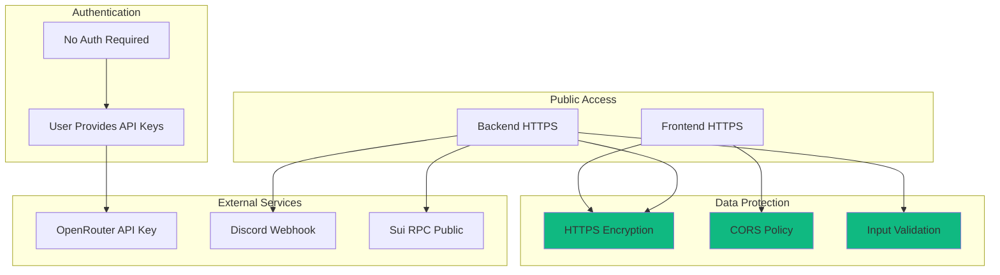

# Sui Invariant Monitor - Workflow Diagrams

This document contains Mermaid diagrams illustrating the workflows and architecture of the Sui Invariant Monitor project.

## 1. Overall System Architecture

## 2. AI Analysis Workflow

## 3. Real-time Monitoring Workflow

## 4. Network Switching Flow

## 5. Data Flow Architecture

## 6. User Journey

## 7. Component Interaction

## 8. Deployment Pipeline

## 9. Error Handling Flow

## 10. Security & Access Control

---

## Usage in README

You can embed these diagrams in your README.md by copying the mermaid code blocks:

\`\`\`mermaid
[paste diagram code here]
\`\`\`

## Notes

- All diagrams use Mermaid syntax compatible with GitHub and most markdown renderers
- Diagrams are designed to be clear and informative for technical documentation
- Color coding: Blue (#4da2ff) for Sui-related, Green (#10b981) for success/security

---

© 2026 Phú Nhuận Builder
